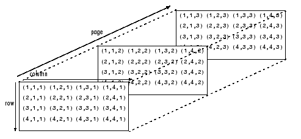

## Array :

**Array** is a data structure consisting of a collection of elements (values or variables), each identified by at least one array index or key

 `The address of i-th array element = array_add + size * i`


##### Row major or row major indexing : (Column index change rapidly)

```C
[0][0]
[0][1]
[0][2]
[0][3]
[0][4]
[0][5]
[0][6]
[1][0]
[1][1]
[1][2]
[1][3]
[1][4]
[1][5]
[1][6]
....

```


##### Column major or Column major indexing : (Row index change rapidly)

```C
[1][1]
[2][1]
[3][1]
[4][1]
[5][1]
[6][1]
[1][2]
[2][2]
[3][2]
[4][2]
[5][2]
[6][2]
....
```


**Multidimensional arrays** are an extension of 2-D matrices and use additional subscripts for indexing. A 3-D array, for example, uses three subscripts. The first two are just like a matrix, but the third dimension represents pages or sheets of elements.



A three-dimensiona array which column-major order with the first element at indices (1, 1, 1).Next element in memory : (2,1,1)


